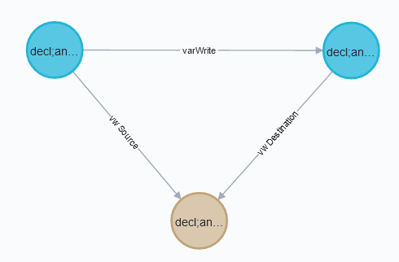
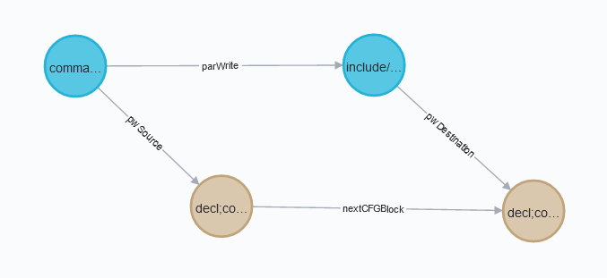
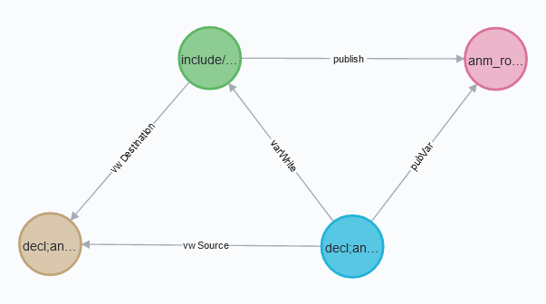
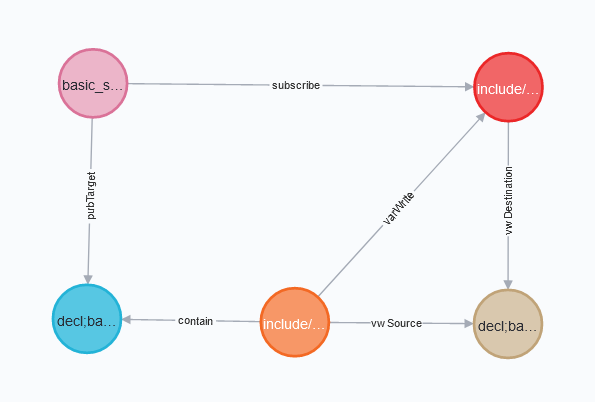

# Modelling CFG Blocks

The CFG Blocks extraced by Rex are modelled after those produced by clang.
However, not all blocks are kept and slight adjustments have been made for our purposes:
- Apart from the entry and exit blocks for a function,
only CFG Blocks that are either branching points,
contain function calls, or contain returns are kept.
- For complex condition expressions, clang may produce multiple CFG Blocks for "early jumping".
For example, in `if (a || b)`, clang will have a CFG Block for evaluating `a`, jumping to the
`true` branch if `a` is `true`, otherwise continuing to the CFG Block for evaluating `b`.
Since this is not useful for us, all CFG Blocks resulting from these conditions are folded
into the final CFG Block for branching, as if we were to always fully evaluate every part of
the condition before deciding where to branch to once.

We aimed to minimize the number of CFG Blocks extracted for performance reasons.

In the neo4j graph database, the CFG Blocks are represented as `cCFGBlock` nodes
with `nextCFGBlock` edges between them indicating control flow.
These `nextCFGBlock` edges may also have one of the following attributes
that distinguish them in special cases:
- `cfgInvoke` = "1" if the edge models a function invocation from a point in which
the function is called to the entry block of the mentioned function.
- `cfgReturn` = "1" if the edge models a return statement from the exit block
of the returning function to a point in which the mentioned function was called.

With this, we may relate facts previously extracted by Rex
to the CFG Blocks in which they occur.

# Relating Facts to CFG Blocks

## Non-ROS-specific facts

It is not possible to directly associate a fact with a CFG Block.
This is because facts are modelled as edges between the relevant nodes.
Thus, in order to obtain this association, we create edges between CFG Block(s)
and the mentioned relevant source and destination nodes for the fact.
For example, if we have the `varWrite` fact given as `(v1)-[:varWrite]->(v2)`
that happens in `(cfg1:cCFGBlock)`, we relate the `varWrite` with `cfg1`
by creating source (`vwSource`) and destination (`vwDestination`) edges
from `v1` and `v2` respectively to `cfg1` so that we have
`(v1)-[:vwSource]->(cfg1)<-[:vwDestination]-(v2)`.



This is analogous for `write`, `call`, `varInfluence`, and `varInfluenceFunc` facts
in which cases their source/destination edges are
`wSource`/`wDestination`, `cSource`/`cDestination`, `viSource`/`viDestination`,
and `vifSource`/`vifDestination` respectively.

However, we handle `varWrite`s in parameter-passing contexts in a special way.
We represent these with a new fact - `parWrite` - which is not associated with
only a single CFG Block like the other facts mentioned.
Instead, the source node is linked to the CFG Block in which the function call happens,
and the destination node is linked to the entry CFG Block of the function called.
Furthermore, between the two mentioned CFG Blocks, there will always be a `nextCFGBlock` edge
with `cfgInvoke` = "1".
So we will have `(v1)-[:parWrite]->(p1)` and
`(v1)-[:pwSource]->(cfgCall)-[:nextCFGBlock {cfgInvoke: "1"}]->(cfgEntry)<-[:pwDestination]-(p1)`.



Distinguishing this from regular `varWrite`s is useful for preventing the exploration of other
`nextCFGBlock` edges that may not be invocation edges from `cfgCall` in the example given,
which should improve the precision of queries that make use of the CFG Blocks.

## ROS facts

We are also interested in the CFG Blocks in which calls to the ROS functions for
publishing a message to a topic and subscribing to a topic happen.
This can be derived from existing CFG Block links for `varWrite` facts.

The CFG Blocks associated with a `publish` fact can be derived with help from the
existing `pubVar` relation.
A node that has a `pubVar` edge to a `rosTopic` node (the destination of a `publish`)
will also have a `varWrite` edge to a `rosPublisher` node (the source of a `publish`).
With this, the CFG Blocks already associated with the mentioned `varWrite` fact
is the one with which the `publish` fact should be associated.



This pattern can be matched using the following `MATCH` clauses together:
```
MATCH (pub:rosPublisher)-[:publish]->(topic:rosTopic)
MATCH (pub)<-[:varWrite]-(v)-[:pubVar]->(topic)
MATCH (v)-[:vwSource]->(cfg:cCFGBlock)<-[:vwDestination]-(pub)
```

Similarly, the CFG Blocks associated with a `subscribe` fact can be derived with help from the
existing `pubTarget` relation.
A node that has a `pubTarget` edge from a `rosTopic` node (the source of a `subscribe`)
will also have a `contain` edge from a `cFunction` node.
This `cFunction` node will then have a `varWrite` edge to a `rosSubscriber` node,
with which we may obtain its associated CFG Blocks.



This pattern can be matched using the following `MATCH` clauses together:
```
MATCH (v)<-[:pubTarget]-(topic:rosTopic)-[:subscribe]->(sub:rosSubscriber)
MATCH (sub)<-[:varWrite]-(f:cFunction)-[:contain]->(v)
MATCH (f)-[:vwSource]->(cfg:cCFGBlock)<-[:vwDestination]-(sub)
```
